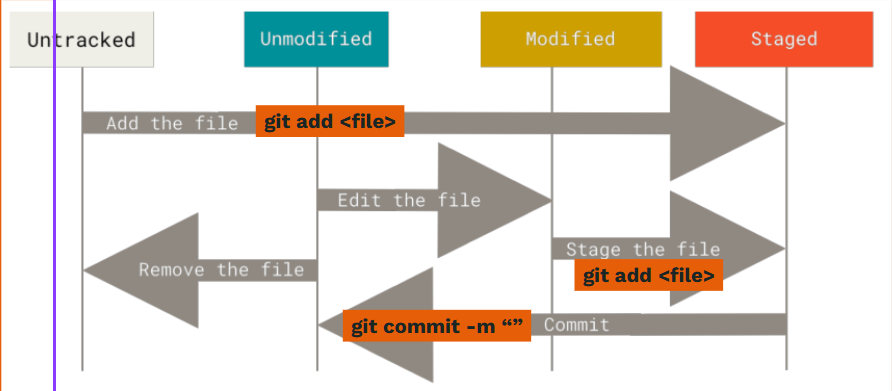

A commit is a saved checkpoint of your project. Before something can be committed, it has to be staged first.

**What to do:**

- Create or modify a file (e.g. `notes.txt`).
- Run `git add <file>` to stage it.
- Run `git commit -m "..."` with a clear, descriptive message.
- You can run `git status` and notice what is printed in the terminal.