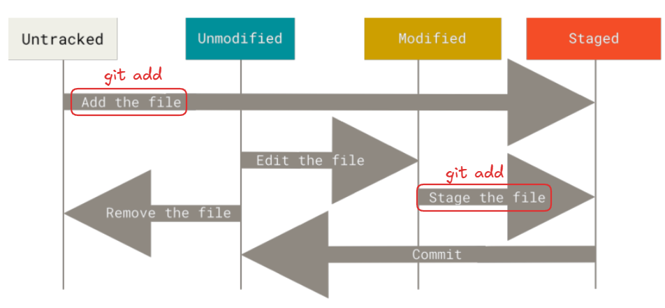

# Git Add
git add is a Git command used to move changes from the working directory to the staging area, preparing them for the next commit.



### Add a Single File
Stages filename.txt for the next commit.
```bash
git add filename.txt
```

### Add Multiple Files
Stages file1.txt and file2.txt.

```bash
git add file1.txt file2.txt
```

### Add All Files in the Directory
Stages all modified, new, and deleted files in the current directory and its subdirectories.

```bash
git add .
```

### Add Specific Patterns
Stages all .txt files in the current directory.

```bash
git add *.txt
```

### Stage Parts of a File
Allows you to interactively select hunks of changes to stage.

```bash
git add -p filename.txt
```

## Untracked Files vs Tracked Files

| Untracked Files | Tracked Files |
|---|---|
| Files that Git is not yet monitoring. | Files that Git is already monitoring (after being added once). |
| Created newly in the project but never staged or committed. | Already committed at least once in the past. |
| Need to be added using `git add` before they can be committed. | Changes must be staged again with `git add` before committing. |
| Example: A new file `notes.txt` you just created. | Example: Editing `app.js` that was already in the repo. |