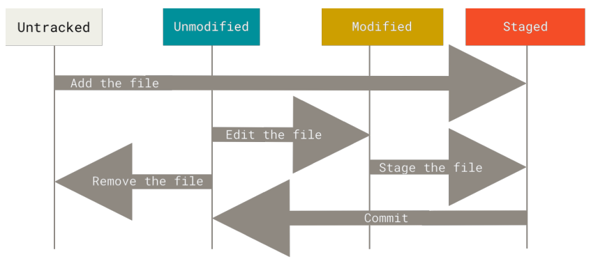

# Git Status
Remember that each file in your working directory can be in one of two states:
- Tracked: files that Git knows about, can be in 3 different statuses:
  - unmodified.
  - modified.
  - staged.
- UnTracked: everything else.



# Task
In the previous phase you clone the repo `https://github.com/libgit2/libgit2`.
Type the following command inside your directory of the repository:
```bash
git status
```

You will see something like this:
```
On branch master
Your branch is up-to-date with 'origin/master'.
nothing to commit, working tree clean
```


> Try editing anyfile then type `git status` again, Have you noticed any changes in the output ?

> Use `git add .` to stage your changes, then type `git status` again.

> Commit those changes using `git commit -m "messege"` and type `git status` again, What is the difference ?.

> Add a new file. Then type `git status`.