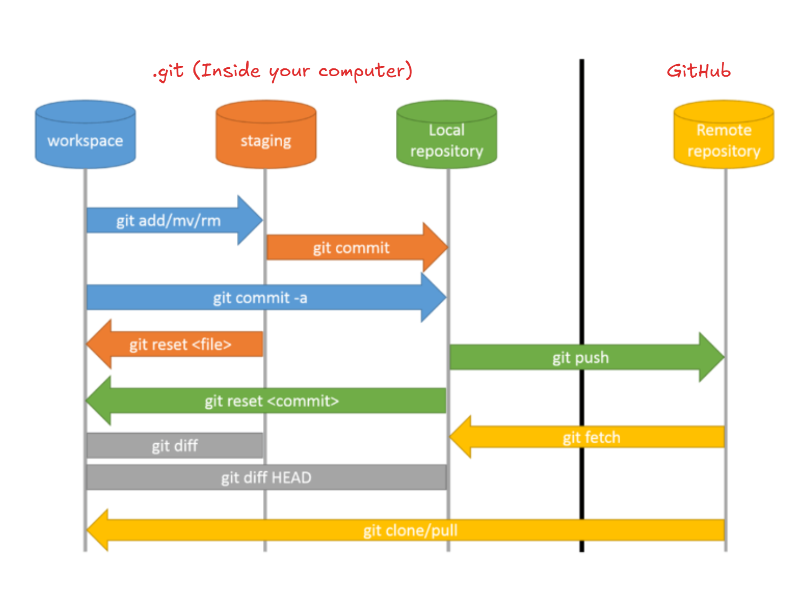

# Git Architecture
Git has three main states that your files can reside in: 
1. modified.
2. staged.
3. committed.

- **Modified** means that you have changed the file but have not committed it to your database yet.

- **Staged** means that you have marked a modified file in its current version to go into your next commit snapshot.

- **Committed** means that the data is safely stored in your local database.

## Basic Git workflow
1. You modify files.
2. You stage the modifications that you want to go to the next commit.
3. You do a commit, which takes the files as they are in the staging area and stores that snapshot permanently in your Git directory.

All the previous steps (modify, stage, commit) happen on your local computer (in the local repository). In the future, you will push changes to a remote repository on GitHub. Think of it like uploading your files to Google Drive.

